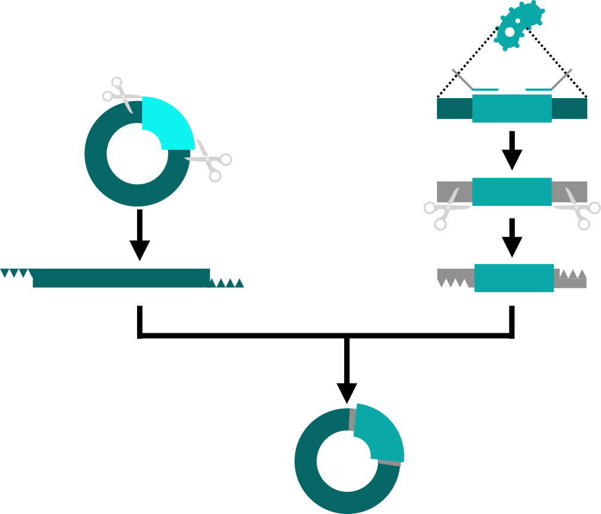
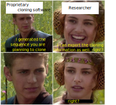
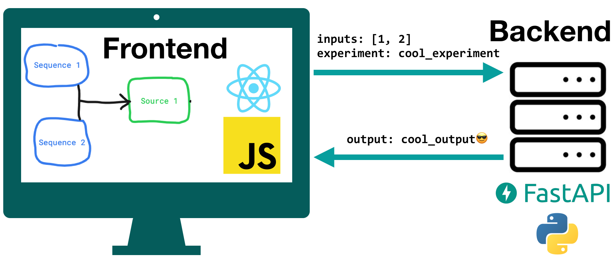
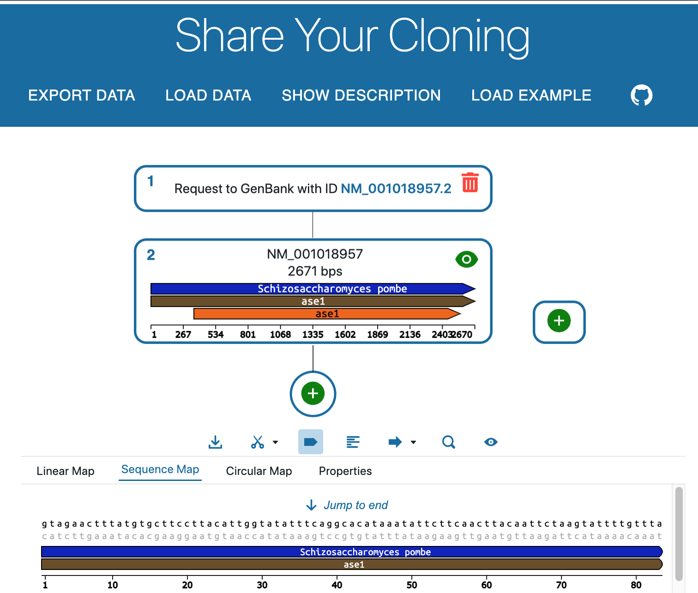

# 😥 The problem 😥

We can describe sequence features in open formats (such as `.gb`), but not cloning strategies.

Let's imagine a typical strategy to clone a gene into a plasmid:

    

1. Amplify the DNA from the organism using PCR with oligonucleotides that contain 5' extensions.
2. Digest the plasmid and PCR product with digestion enzymes.
3. Ligate the digested products.

<!-- 🤔 Well, there must be an Open Standard to encode this since this is routinely done in **hundreds of laboratories**.

<strong>🚨Spoiler alert🚨</strong> That is not the case
 -->

    

# 🤔 The solution? 🤔

In ShareYourCloning, we use `json` to document two types of sequence sources:

## 1. Sequence is newly generated

graph LR;
    A[<code>Sequence
id: 1</code>]-->C["<code>Source
id: 3 input: [1,2] output: 4 experiment_specific_stuff ...</code>"];
    B[<code>Sequence
id: 2</code>]-->C;
    C-->D[<code>Sequence
id: 4</code>];

## 2. Sequence in collection / naturally occurring

graph LR;
    B["<code>Source
id: 1 input: [] output: 2 request_to_your favourite_database</code>"]-->A[<code>Sequence
id: 2</code>];
    C["<code>Source
id: 1 input: [] output: 2 a_file</code>"]-->D[<code>Sequence
id: 2</code>];

Enter 🔥🔥 **ShareYourCloning** 🔥🔥, a web application where you can simulate your cloning strategy and export it in this format to share with others or for publication.

    

# 🙋 Try it yourself! 🙋‍♂️

<a href="https://shareyourcloning.netlify.app/">https://shareyourcloning.netlify.app/</a>

    

    

# <i class="fab fa-github"></i> 🛠️ Get involved! 🛠️ <i class="fab fa-github"></i>

<a href="https://github.com/manulera/ShareYourCloning/">https://github.com/manulera/ShareYourCloning/</a>

|Frontend repo|Backend repo|Contributing.md|
|--|--|--|
||||

